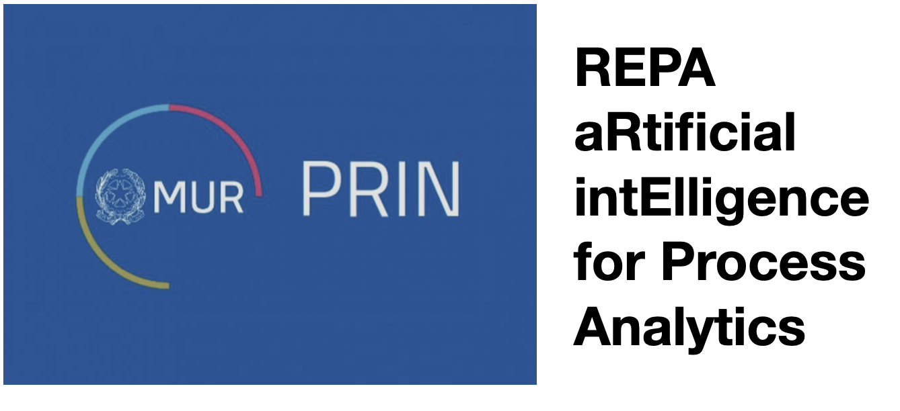

<h1>Next Gen Data and Process Management: Large Language Models and Beyond 

Sunday, June 22, 2025. Workshop @ SIGMOD 2025
</h1>

 
The Workshop of Next Gen Data and Process Management: Large Language Models and Beyond (LLM-DPM), held in conjunction with the 2025 ACM SIGMOD Conference in Berlin, Germany, will explore the transformative role of Explainable AI (XAI), Trustworthy AI, and Large Language Models (LLMs) in revolutionizing Data and Process Management systems. Organizations across industries rely on complex processes to deliver products, services, and outcomes. Understanding these processes is critical for uncovering inefficiencies, addressing bottlenecks, ensuring compliance, and driving operational excellence.  

Process mining, which leverages event logs from data systems, has emerged as a powerful approach for visualizing workflows, identifying anomalies, and optimizing processes. However, traditional methods such as surveys and interviews remain costly, error-prone, and disconnected from real operations. This workshop aims to bridge this gap by examining how cutting-edge AI techniques, particularly LLMs, can advance process mining and data management.  

The workshop will focus on the emerging role of explainable AI and LLMs in addressing long-standing challenges such as query interpretation, data augmentation, user interaction, system optimization, future process prediction, and actionable insights for proactive decision-making. Particular attention will be paid to accountability and fairness to ensure these advancements lead to transparent, equitable, and resilient systems.  

Additionally, the workshop will tackle critical challenges in integrating AI into process mining, including data quality, scalability of analysis techniques, and the complexity of large datasets. Discussions will fill gaps left by main track topics, delving into specific use cases, risks, and technical innovations in data-centric environments. By fostering dialogue between researchers and practitioners, the workshop will provide advancements at the intersection of AI, process mining, and database systems, driving both research and enterprise adoption.  

## Schedule (Tentative, subject to change)

<!--The program will consist of one keynote from [Wil van der Aalst](https://en.wikipedia.org/wiki/Wil_van_der_Aalst) (widely considered the godfather of Process Mining), panels, and contributed talks, including talks on accepted papers and other invited talks. -->

| Time      | Title |
| ----------- | ----------- |
| 10:00AM      | **Keynote**   Wil van der Aals |
| 11:00AM - 11:30AM| [**Detection of Personal Data in Structured Datasets Using a Large Language Model.**](./files/personaldata.pdf)    Albert Agisha Ntwali, Luca Rück, Martin Heckmann. |
|11:30AM - 12:00PM|  [**Text2Cypher: Data Pruning using Hard Example Selection**](./files/text2cypher.pdf)  Makbule Gulcin Ozsoy|
|12:00PM - 1:00PM| **Lunch Break** |
|1:00PM - 2:00PM| **Keynote by**   Prof. Ernesto Damiani|
|2:00PM - 2:30PM| [**Disentangling Event Logs With Large Language Models**](./files/eventlog-llm.pdf)   Gregory Benton, Lampros Flokas, Cong Yu|
|2:30PM - 3:00PM| [**From Theory to Practice: Real-World Use Cases on Trustworthy LLM-Driven Process Modeling, Prediction and Automation**](./files/trustpm.pdf)  Peter Pfeiffer, Alexander Rombach, Maxim Majlatow, Nijat Mehdiyev|

## Keynotes

### Keynote 1: LLMs Are Not Enough: Why Broken Processes Still Break Promises in the Age of AI

**Abstract**:
Large Language Models (LLMs) are dazzling—summarizing meetings, generating reports, and even drafting code. The explosion of generative, predictive, and prescriptive AI offers breathtaking possibilities. Yet despite this technological leap, many organizations still crumble under simple tasks: delayed flights, unpaid invoices, missed appointments, and paralyzed supply chains. Why? Because AI is often deployed at the surface level-supporting isolated tasks-while the underlying end-to-end processes remain opaque, fragmented, and broken. The real bottleneck isn't intelligence at the edge, but the lack of process awareness at the core. In this keynote, I will argue that object-centric process mining is essential to close the gap between AI’s promise and operational reality. I will show various experiments using LLMs in the context of process management and discuss when things work and when things fail. I will use his to point out opportunities for predictive and prescriptive AI. Only by revealing, analyzing, and improving the actual flows of work can we ensure that LLMs and other AI tools lead to real impact rather than digital lipstick on analog dysfunction.

**Short Bio**: **Prof.dr.ir. Wil van der Aalst** is a full professor at RWTH Aachen University, leading the Process and Data Science (PADS) group. He is also the Chief Scientist at Celonis and part-time affiliated with the Fraunhofer FIT. Currently, he is also deputy CEO of the Internet of Production (IoP) Cluster of Excellence and co-director of the RWTH Center for Artificial Intelligence. His research interests include process mining, Petri nets, business process management, workflow automation, simulation, process modeling, and model-based analysis. Many of his papers are highly cited (he is one of the most-cited computer scientists in the world and has an H-index of 186 according to Google Scholar with over 160,000 citations), and his ideas have influenced researchers, software developers, and standardization committees working on process support. According to Research.com, he is the second highest-ranked computer scientist in Germany and ranked 9th worldwide. He previously served on the advisory boards of several organizations, including Fluxicon, Celonis, ProcessGold/UiPath, and aiConomix/Automaited. Van der Aalst received honorary degrees from the Moscow Higher School of Economics (Prof. h.c.), Tsinghua University, and Hasselt University (Dr. h.c.). He is also an IFIP Fellow, IEEE Fellow, ACM Fellow, and an elected member of the Royal Netherlands Academy of Arts and Sciences, the Royal Holland Society of Sciences and Humanities, the Academy of Europe, the North Rhine-Westphalian Academy of Sciences, Humanities and the Arts, and the German Academy of Science and Engineering. In 2018, he was awarded an Alexander-von-Humboldt Professorship. 

### Keynote 2: Tuning LLMs to consistency via custom loss functions

**Abstract**: People have become accustomed to interacting with their favorite LLM interface and requesting all sorts of classification and prediction tasks.  LLM stewardship encompasses the detection, outcome prediction, and compliance checking tasks performed on logs that serve as evidence of human or system behavior. In narrow contexts, general-purpose large language models (LLMs) sometimes end up playing the role of glorified fortune-tellers. The talk uses the example of symmetry-aware loss functions to discuss how custom loss functions can be used – directly in lightweight tuning or via generation of ad-hoc tuning data - to improve quality, consistency, explainability, and even human acceptance of LLM advice about behavioral logs.

**Short Bio**: **Ernesto Damiani** is Full professor at the Department of Computer Science, Università degli Studi di Milano, Italy, where he leads the SESAR research lab, and President of the Consorzio Interuniversitario Nazionale per l'Informatica (CINI).He serves also as Dean of Computing and Mathematical Sciences and Director of the Center for Cyber Physical Systems (C2PS) at Khalifa University in the UAE. Ernesto’s research interests include secure service-oriented architectures (SOA), certifiable robust Artificial intelligence and Data Analytics models, and cyber-physical systems security. Dr. Damiani received a doctorate honoris causa from Institute National de Sciences Appliquees (INSA) of Lyon, France, for his contributions to Big Data analysis platforms and architectures. In 2022, Ernesto was awarded the rank of Officer of the Order of the Star of Italy for his contributions to international scientific collaboration in AI.

## Call for Papers

This workshop invites papers that present works that lay in the intersection between data management, AI, and process mining.   As such, we encourage both standard research papers, demonstrations, as well as work that is in-progress, reports on experiences, or proposes speculative new approaches. The event provides a suitable environment to discuss new approaches presented by researchers and practitioners.  The workshop will bring together leading researchers, engineers and scientists who are actively working on these topics.  

### Topics of interest

* **Core Process Mining**
    * Application of Deep Learning for Process Mining
    * Streaming Process Mining
    * Automated Process Modelling and Updating
    * Explainable AI for Process Discovery

* **Systems, Models, and algorithms for Process Analytics and Prediction**
    * Machine Learning in Object-centric Process Mining
    * Predictive Process Monitoring
    * Conformance Checking

* **Explainable, Reliable, and Trustworthy Process Mining**
    * Right to Explanation in Process Mining
    * Developing interpretable techniques for workflow optimization.
    * Visualization methods for LLM-driven process analysis and decision-making.

* **Data preparation and management for Process Mining**
    * ETL for process data
    * Anomaly Detection for Process Mining
    * Strategies for integrating textual, visual, and structured data
    * Methods for identifying and mitigating bias in data ingestion, cleaning, and transformation.

* **LLMs as interfaces to databases**
    * Advances in natural language interfaces to improve query formulation and interpretation.
    * Simplifying database interactions for non-technical users through user-friendly, AI-powered interfaces.
    * Strategies for integrating textual, visual, and structured data into LLM-based systems.

* **Process Monitoring and Automation**
    * Visual or NLP interfaces for process monitoring
    * Large Language Models interfaces for Process Mining
    * Process visualization
    * Machine Learning and Agents for Robot Process Automation
    * Co-pilots and user interfaces for process automation

* **Bias and Reliability in AI-driven Process Science**
    * Ensuring fairness in LLM-supported process evaluation and optimization decisions.
    * Strategies for ensuring robustness and reliability of AI-driven process-oriented systems

* **Explainable and trustworthy LLM-driven systems**
    * Improving the transparency of LLM-based query translation and optimization processes.
    * Develop frameworks for verifying AI-generated database recommendations.

* **Emerging risks in LLM-driven data systems**
    * Ethical concerns in using LLMs in high-stakes environments.
    * Security vulnerabilities introduced by AI-powered database systems.

### Submission Guidelines

We invite submissions from 4 to 8 pages, not including references. 
<!--Papers may have at most 2 additional appendix pages.-->
Authors are requested to prepare submissions following the [ACM proceedings format](https://www.acm.org/publications/proceedings-template) consistent with the SIGMOD submission guidelines. Please use the latest ACM paper format with the sigconf template, and [here is an overleaf for convenience](https://www.overleaf.com/latex/templates/association-for-computing-machinery-acm-sig-proceedings-template/bmvfhcdnxfty). LLM-DPM is a single-anonymous workshop, authors must include their names and affiliations on the manuscript cover page.

* [Submission website](https://llm-dpm25.hotcrp.com/)
* [SIGMOD Inclusion and Diversity in Writing](http://2025.sigmod.org/calls_papers_inclusion_and_diversity.shtml)

### Important Dates

* Submission deadline: April 1 2025, 5pm Pacific Time
* Submission website: [https://llm-dpm25.hotcrp.com/](https://llm-dpm25.hotcrp.com/)
* Notification of acceptance: April 25, 2025 --- delayed to ---> May 2, 2025
* Final papers due: May 16, 2025
* Workshop: Sunday, June 22, 2025

## Organizers

* Faiza Allah Bukhsh (University of Twente) - f.a.bukhsh@utwente.nl
* Paolo Ceravolo (University of Milan) - paolo.ceravolo@unimi.it
* Samira Maghool (University of Milan) - samira.maghool@unimi.it
* Xu Chu (Celonis) - x.chu@celonis.com
* Eugene Wu (Columbia University) - ewu@cs.columbia.edu
* Cong Yu (Celonis) - cong.yu@celonis.com

## Sponsors

* 
* 
